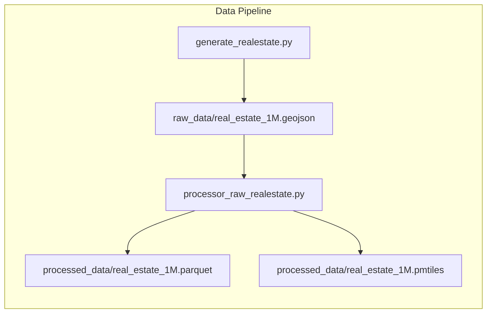
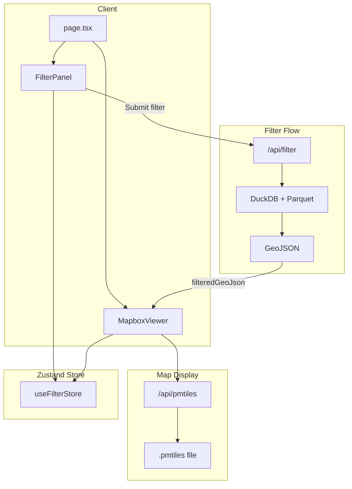

# POC Mapbox 1M Points

Proof of concept สำหรับแสดงอสังหาริมทรัพย์ 1 ล้านจุดบนแผนที่ Mapbox โดยใช้ **PMTiles** (vector tiles) สำหรับการโหลด map ที่รวดเร็ว และ **Parquet + DuckDB** สำหรับการ filter ที่มีประสิทธิภาพ

## Getting Started

### 1. Clone และติดตั้ง dependencies

```bash
git clone <repo-url>
cd poc_mapbox1m
npm install
```

### 2. Environment

- Copy `.env.example` เป็น `.env`
- ใส่ `NEXT_PUBLIC_MAPBOX_ACCESS_TOKEN` (จำเป็นสำหรับ map)
- Supabase เป็น optional (ใช้สำหรับ property list ถ้ามี)

```bash
cp .env.example .env
# แก้ไข .env และใส่ NEXT_PUBLIC_MAPBOX_ACCESS_TOKEN
```

### 3. Data Pipeline (สร้างข้อมูล 1M points)

โปรเจกต์ใช้ไฟล์ `real_estate_1M.pmtiles` และ `real_estate_1M.parquet` ซึ่งไม่ได้ commit (อยู่ใน `.gitignore`)

**ขั้นตอน:**

1. สร้าง Python venv และติดตั้ง dependencies:

```bash
cd data-pipeline
python -m venv .venv
source .venv/bin/activate   # Windows: .venv\Scripts\activate
pip install -r requirements.txt
cd ..
```

2. ติดตั้ง **tippecanoe** (สำหรับสร้าง PMTiles):

```bash
brew install tippecanoe   # macOS
```

3. สร้างข้อมูล:

```bash
npm run generate-data   # สร้าง raw_data/real_estate_1M.geojson
npm run process-data    # สร้าง processed_data/*.parquet และ *.pmtiles
```

### 4. รัน dev server

```bash
npm run dev
```

เปิด `http://localhost:3000`

---

## Architecture

### Data Pipeline Flow

ข้อมูลอสังหาริมทรัพย์ 1M จุดถูกสร้างและประมวลผลผ่าน pipeline ดังนี้:



### Runtime Flow (Map + Filter)



### สรุปการทำงาน

- **PMTiles**: Vector tile format — Mapbox โหลดเฉพาะ tile ที่มองเห็น (zoom/x/y) ทำให้ 1M points โหลดเร็ว
- **Parquet + DuckDB**: Filter API query Parquet ด้วย DuckDB ใน memory — filter ได้เร็วโดยไม่ต้องโหลดทั้งหมด
- **Zustand**: Filter state แชร์ระหว่าง FilterPanel และ MapboxViewer

---

## Demo

### 1. Map Loading Speed (1M points)

แสดงความเร็วในการโหลด map ครั้งแรก — สามารถโหลด 1M points ได้ในเวลานิดเดียวโดยใช้ vector tile file (.pmtiles)

> ใส่ไฟล์ `docs/demo/demo-map-loading.gif` เพื่อแสดง demo การโหลดหน้าแรก — map แสดง cluster/จุดได้ทันที


### 2. Filter Speed (Parquet)

แสดงการใช้ filter ว่าสามารถ filter ได้รวดเร็วโดยใช้ .parquet file กับ DuckDB

> ใส่ไฟล์ `docs/demo/demo-filter.gif` เพื่อแสดง demo การกด filter (เช่น price range) แล้วผลลัพธ์อัปเดตเร็ว


### การ record demo .gif

1. รัน `npm run dev` และเปิด `http://localhost:3000`
2. ใช้เครื่องมือ record หน้าจอ (เช่น LICEcap, Kap, ScreenToGif)
3. บันทึกไฟล์ลง `docs/demo/`:
   - `demo-map-loading.gif` — record การ refresh หน้าและโหลด map
   - `demo-filter.gif` — record การเปิด filter panel, ใส่เงื่อนไข, กด Submit

---

## โครงสร้างโปรเจกต์

```
docs/
  demo/
    demo-map-loading.gif   # (ใส่เอง)
    demo-filter.gif        # (ใส่เอง)
data-pipeline/
  generate_realestate.py   # สร้าง GeoJSON 1M จุด
  processor_raw_realestate.py  # แปลงเป็น Parquet + PMTiles
src/
  app/                     # Next.js App Router
  components/              # FilterPanel, MapboxViewer
  lib/map/                 # PMTiles, layers, interactions
  store/                   # Zustand filter state
```
